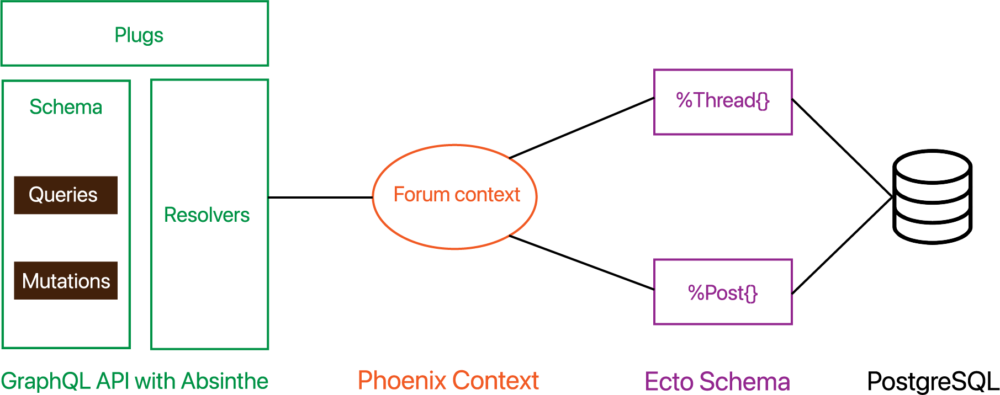

# Forum GraphQL Server

To start the server:

  * Install dependencies with `mix deps.get`
  * Create and migrate database with `mix ecto.setup`
  * Start GraphQL endpoint with `mix phx.server` or inside IEx with `iex -S mix phx.server`

Now you can visit [`http://localhost:4000/graphiql`](http://localhost:4000/graphiql) from your browser.

## The big picture

  

## The Data Model:

The Data Model has two entities: Thread and Post. They are stored in the
PostgreSQL database under tables `threads` and `posts`, respectively.

## Ecto Schemas

We have corresponding Ecto Schemas map to each of thoes database tables.